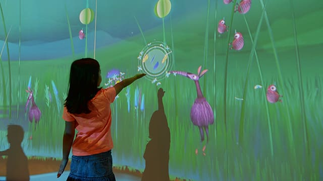
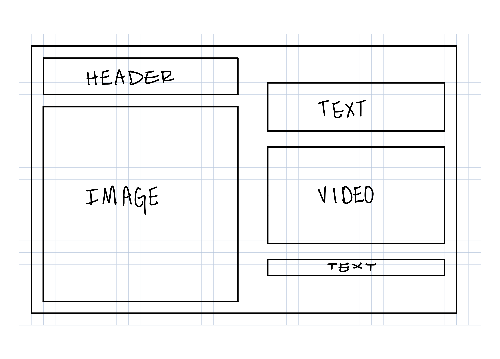
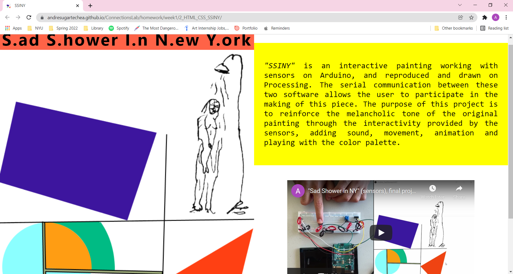

## Week 1:

### Class I, pt.1 | January 25th: _"Pick a connected application of your choice. It can be from the list we looked at in class or otherwise. Write a 300-500 word critique on the application. What do you think works? What doesn't? What would you like to do differently? This has to be available on your GitHub."_

The connected application that was the most appealing for me was [_“Connected Worlds”_](https://classic.nysci.org/experiencenysci/exhibits/connected-worlds/) by NYSCI for its subject-matter, that is sustainability, and for its location in New York. The concept of this app is to give the user the experience of living in multiple ecosystems while being responsible for their preservation. The goal is to make the audience aware of the impact that their actions can have on the environment, creating interactive sequences with animations that continue in function of the decisions of the user.

From the advertisement on their website and its aesthetics, I deduce that the target audience for this application is mainly kids and adolescents. The animation of the flaura and fauna are fanciful, which I consider a good approach to make the application attractive for children, especially when talking about a topic difficult or boring to explain like sustainability.  Appart from its appearance, I think what works really well is displaying the application in a wide and big panoramic space, so it creates an even more immersive illusion of being inside of the animation. The variety of possible interactions diversifies the experiences and allows users to have each one an interpretation of the application.

However, I think what doesn’t work for this application is that the same type of aesthethics that are attractive for a young audience might be unappealing for an older one, which would limit its reception and impact. From my point of view, when a topic is treated with a tone for kids it substracts seriousness and importance. I think this could be fixed by changing the animation, with animals and ecosystems that look more similar to the real world. In addition to this, I think I’d be fantastic to have something to interact with out of the screen, like buttons or levers that complement the interactivity.

--

### Class I, pt.2 | January 27th: _"MAKE a simple wireframe of one of your present/past projects. If you have multiple wireframes, that's ok! Share all of them as part of your process. MAKE a webpage version of the wireframe you have designed. Your assignment should include a .html file and a .css file."_

For this assignment, I decided to code a website for my _Introduction to IM_'s final project called _"SSINY"_, an interactive painting working with sensors on Arduino, and reproduced and drawn on Processing. The serial communication between these two software allows the user to participate in the making of this piece. The purpose of this project is to reinforce the melancholic tone of the original painting through the interactivity provided by the sensors, adding sound, movement, animation and playing with the color palette.

To showcase my project on the website, I want to have an image displaying my artwork and a video explaining how it works with the sensors. This is the wireframe I considered the most efficient for this:

#### Wireframe :

Coding the website was simple after learning how to use ['display: flex'](https://flexboxfroggy.com/) on CSS. I also coded a sample webpage to study the different tags on HTML and properties on CSS.

#### Preview: 

[_Click here to see my website_](https://andresugartechea.github.io/ConnectionsLab/homework/week1/2_HTML_CSS_SSINY/)

