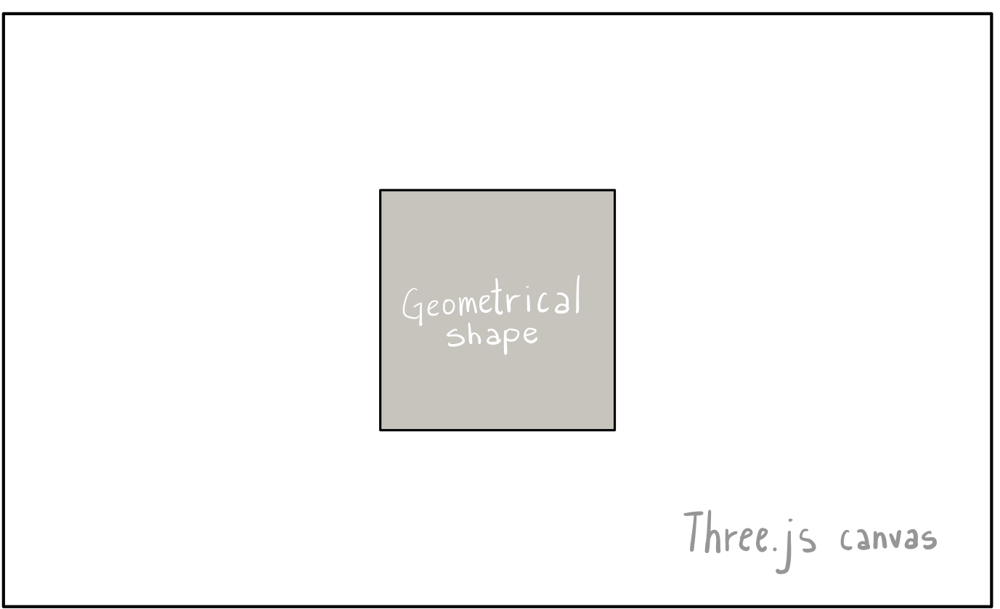
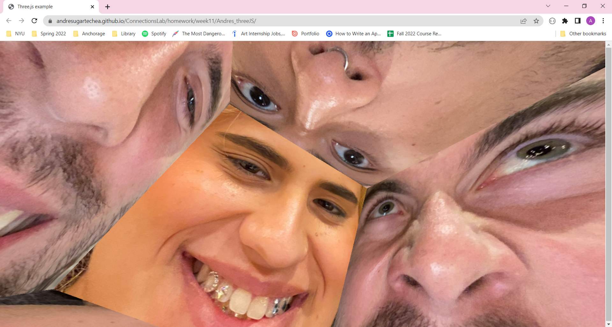
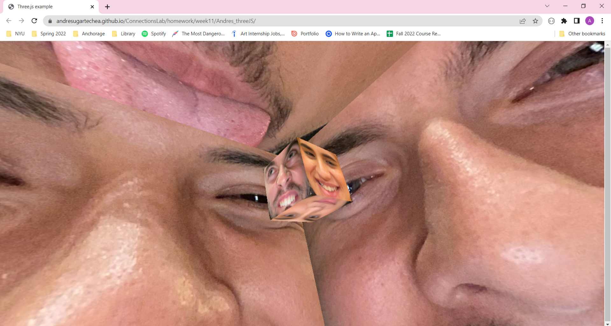
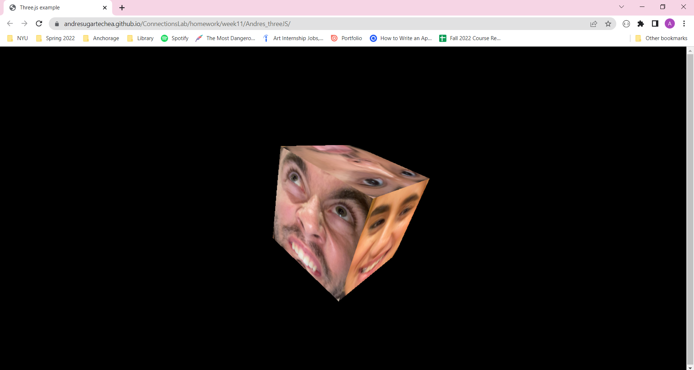

## Week 11:

### Class II, pt.2 | April 21st: _"MAKE a simple page with one of the following libraries - D3, Three.js, Ml5, Aframe, Tone.js, Rivescript, Leaflet. Ensure that you work with a library that you have not worked with before. DOCUMENT your progress and learnings from the making of the webpage"_

For this week’s assignment, I decided to work with [Three.js](https://threejs.org/). It was the JavaScript library whose examples appealed to me the most, particularly the [Apple website](https://www.apple.com/in/iphone-13/) since it made me understand the relevance of mastering this tool. My goal for this assignment was to use the documentation and online tutorials to learn the basics of Three.js and feel comfortable with it.

#### Wireframe and steps:

The wireframe for this website is very simple. I wanted the canvas to cover all the page, so I could focus on the implementation of different features from the library rather than on the UI. On the canvas, I render and animate one geometrical shape and experiment on different ways we can play with it on Three.js, such as changing the color, size, texture, etc.

#### Preview: 

[_Click here to see my website_](https://andresugartechea.github.io/ConnectionsLab/homework/week11/Andres_threeJS/)

