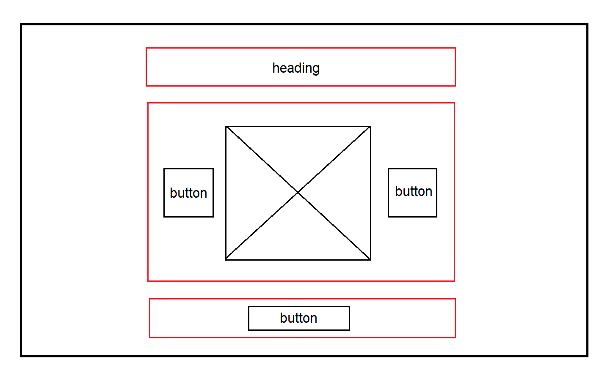
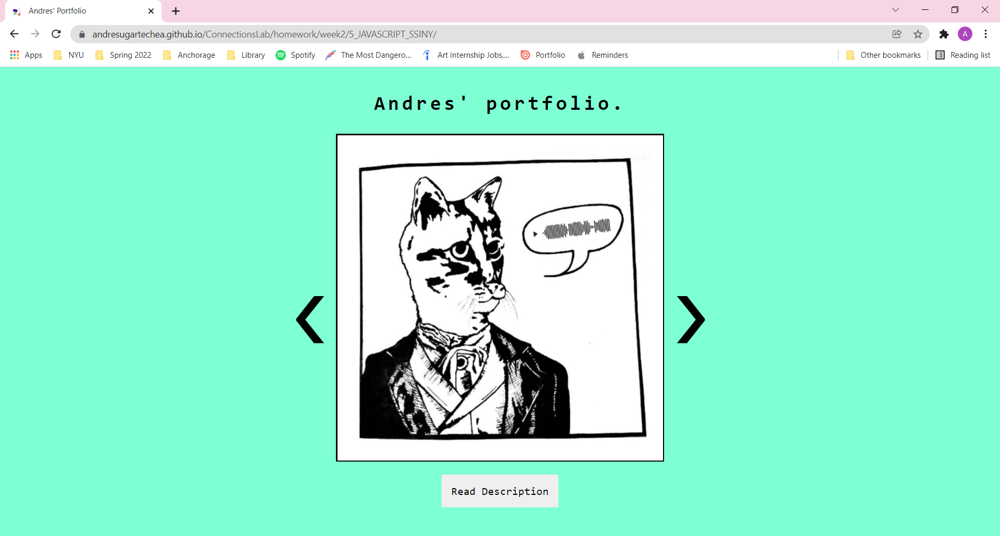

## Week 2:

### Class II, pt.2 | February 3r: _" MAKE a meaningful webpage (or part of a larger web application) that has at least two event-driven user interactions that are handled in a script.js file."_

For this assignment, I decided to keep constructing my portfolio's website. Since one of the options was to create an image carousel I thought of using this interaction to display the projects I've been making in the previous years with a brief description.

To continue with the minimalist theme of my last assignment, I divided my wireframe in three sections with a header, the image carousel, and a button for reading the description:

#### Wireframe :

My lack of practice with JavaScript made me come up with an unpolished product. Some changes that I want to make in the future is to add different states to the _"Read description"_ button so the user is able to see the image described again. In addition, I want to incorporate a menu to link all my websites and give homogeneity.

#### Preview: 

[_Click here to see my website_](https://andresugartechea.github.io/ConnectionsLab/homework/week2/5_JAVASCRIPT_SSINY/)

