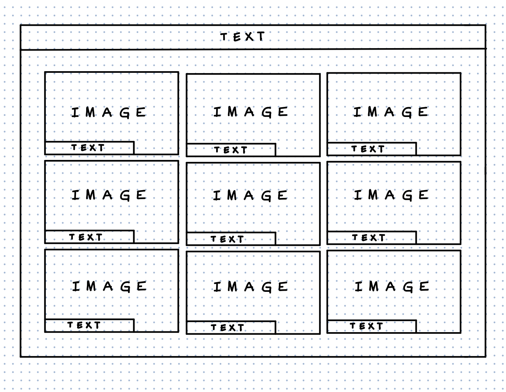
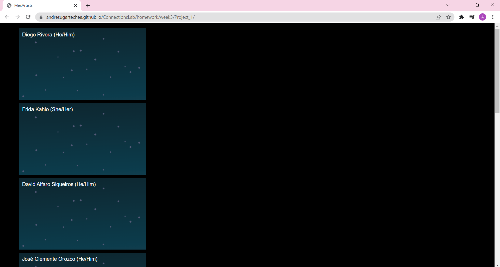

## Week 3:

### Class III, pt.2 | February 10th: _"MAKE an initial version of your project where data is displayed on the page either on page load or as a result of a user interaction. You are welcome to go further than this and start to incorporate p5, but you should at least have identified a data set that you intend to use and be able to properly display relevant info on the page."_

My project is a webpage with a design similar to a Zoom meeting presenting boxes displaying famous Mexican artists. The target audience is people interested in knowing more about visual arts and culture. With my project, the viewer is going to be able to interact with the artists by clicking on different features on each one of the boxes. For example, one of the boxes is going to contain a cartoon of Diego Rivera with his name and pronouns on a corner and an option to play one of his quotes. His background is going to be one of his paintings and when it’s clicked the image is going to be displayed full screen. Since I’m making my own data set in a JSON file, more information and interactions will be introduced depending on its feasibility. If it works as I expect, I plan on using this idea as my art journal to document my discoveries.

#### Wireframe :

#### Preview: 

[_Click here to see my website_](https://andresugartechea.github.io/ConnectionsLab/homework/week3/Project_1/)
