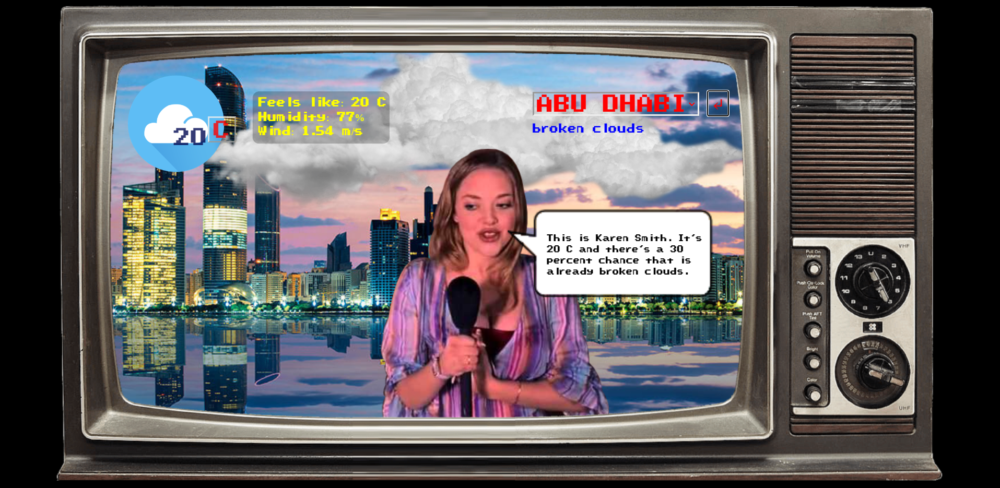
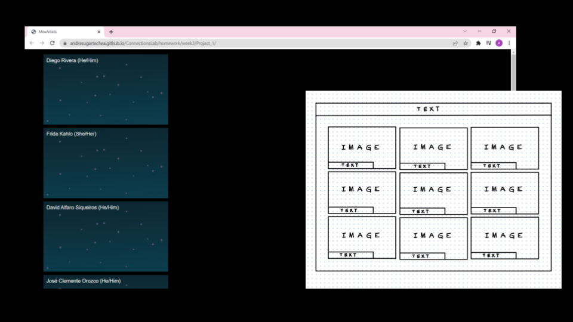
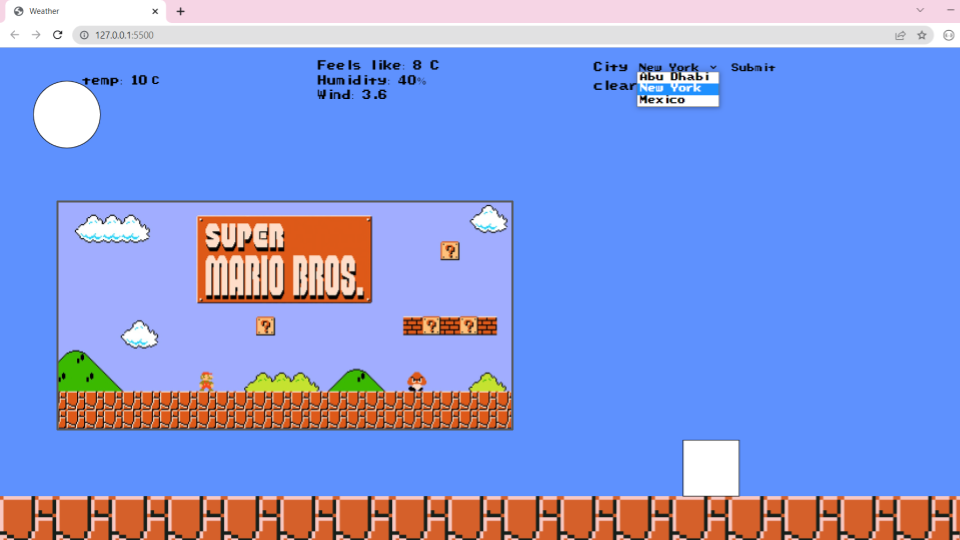
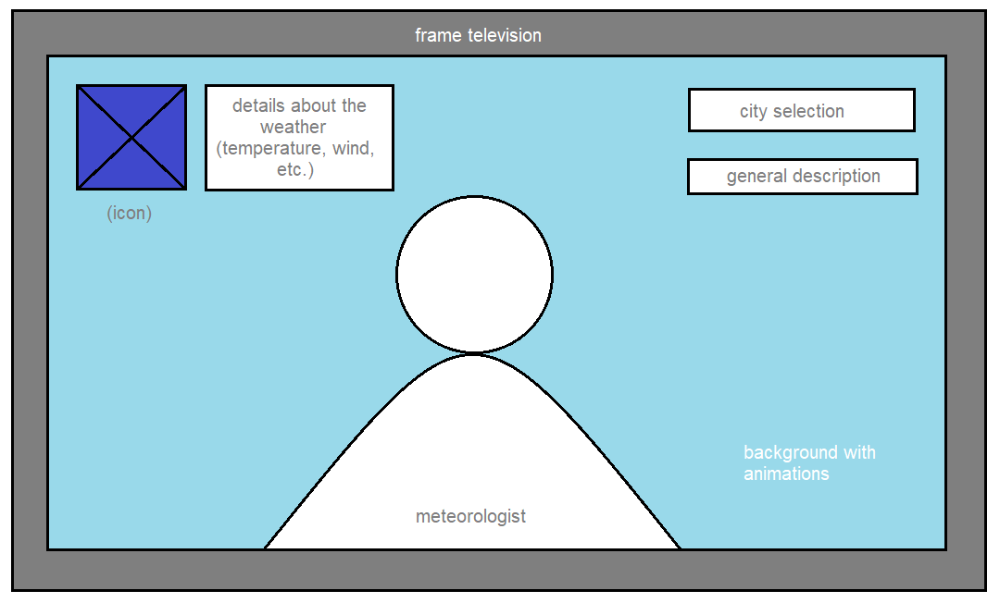
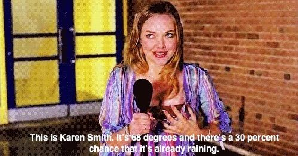
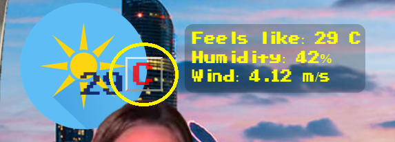
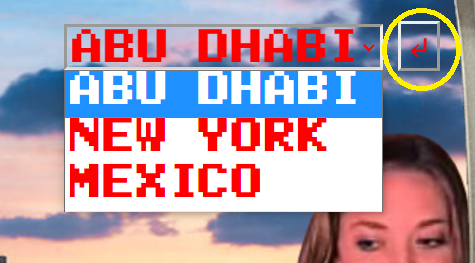
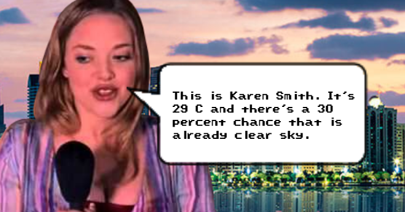

# Connections Lab | Project 1: _Karen Smith's Weather Report_

## Description:

[_Karen Smith's Weather Report_](https://andresugartechea.github.io/ConnectionsLab/homework/week4_and_5/project_1/) is a weather forecast website inspired by the famous character of Mark Waters’ film from 2004, “Mean Girls”. The website allows the user to check the weather in real-time in three different cities: Abu Dhabi, New York, and Mexico. It also gives the option to use either the imperial or metric system for the temperature and wind speed. The creativity of this project comes with the animation that changes according to the weather information.



## Process:

   #### First drafts:

This project started as a [website with a design and interaction similar to Zoom](https://andresugartechea.github.io/ConnectionsLab/homework/week3/Project_1/), presenting an art journal of important Mexican visual artists. The concept was to have each character in a box that displays information about them with animations that change with the user interaction. Unfortunately, the project was discarded for its complexity and time constraints, but the idea of interactivity was kept for the next concept.




The second concept that helped mold the final version was a Mario Bros videogame that displays different scenarios and animations representing the weather. The idea was started but discarded since it was similar to a previous project I had worked on before.



The final concept aimed to combine both concepts: an interactive box (in this case, a television) that displays information about the weather and a famous character that represents the meteorologist.

   #### Wireframe and concept: 
   
   
   
The concept of this project is to be a tribute to Karen Smith from Mean Girls, making a reference to the scene where she accomplishes her dream of  forecasting the weather on a tv channel. The target audience is fans of Mean Girls or pop culture that check the weather.



 My purpose for this first project was to have fun while learning more about website design and development.

   #### Major problems and solutions:
   
1. The main challenge for this project was to figure out how to work with API’s, since it was my first time doing so. An important resource that helped me with this was the tutorial by [The Coding Train](https://www.youtube.com/watch?v=DbcLg8nRWEg). Although his tutorial is from three years ago, the way he implements [Open Weather’s API](https://openweathermap.org/api) is similar to the one I had to use:


```
//to define the URL for the API
let api = "https://api.openweathermap.org/data/2.5/weather?";
let lat = "lat=24.4539";      //by default it shows AD's weather
let lon = "&lon=54.377";
let apiKey = "&appid=e6e914a5263977da0216e71cb16d1b51";
let unit = "&units=metric";

//to fetch data
function fetchData() {
  let URL = api + lat + lon + apiKey + unit;
  fetch(URL)
  .then(response => response.json())
  .then(data => {
    weather = data;
    console.log(weather);
  })

}
```


2. The second challenge was to learn how to use the information from the API, already fetched, in JavaScript. After multiple tests I used the following method: 

(example with the temperature value):

In the .html file:
```
<!-- temperature of the weather -->
<div class="temperature">
	<p id="tempValue">Temperature</p>
</div>
```

In the .js file:

```
function draw(){

  background(94,145,254);

  //if data fetched
  if (weather){
    tempValue.innerHTML = round(weather.main.temp);
  }
}
```

For the other details about the weather I followed the same logic. 

   #### Summary of the steps followed:
  
1. Fetch the data from the API.
2. Assign elements from the data to a variable in the .js file.
3. Call an id from the .html file to modify the text content with the variables.
4. Display images of the background according to the location selected by the user (_displayCity()_).
5. Check general description of the weather and display animation according to that (_checkWeather()_).
6. Display image of "Karen Smith" that moves following the 'x' position of the cursor (_displayKaren()_).
7. Display dialogue when a key is pressed (_displayDialogue()_).

```
function draw(){

  background(94,145,254);

  if (weather){
    displayCity();
    
    //change unit of temperature
    tempUnitValue = document.getElementById("tempUnit").value;

    tempValue.innerHTML = round(weather.main.temp);
    feelsValue.innerHTML = "Feels like: "+ round(weather.main.feels_like) + " " +  document.getElementById("tempUnit").value;
    humidValue.innerHTML = "Humidity: "+ weather.main.humidity + "%";
    windValue.innerHTML = "Wind: "+ weather.wind.speed + windUnitValue;
    description.innerHTML = (weather.weather[0].description);

    checkWeather();
    displayKaren();
    displayDialogue();
  }
}
```

## Final result: 

   ### User interaction:
   
 · Change from metrical to imperial unit and viceversa.
 
     
   
 · Change location of weather forecast.
 
   
   
 · Display dialogue.
 
   
  
 · Move Karen Smith with your mouse.

   
   ### Next steps:
   
 Based on the feedback given by my friends and classmates, I'd like to implement in the future the following functionalities:
 - More Mean Girls' easter eggs and references with the animations.
 - Add the time and date, so it can be more functional for daily purposes. 
 - Design the website also for mobile devices.
 - Making this a software widget.

[Click here to see my website :)](https://andresugartechea.github.io/ConnectionsLab/homework/week4_and_5/project_1/)


