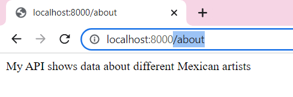

## Week 3:

### Class VI, pt.2 | March 3rd: _"MAKE a Node-Express app that serves a web page. This webpage should use an API that you need to fetch. The API should be from your server (a custom API). Make atleast 1 API that uses .params or query."_

For the creation of my first server I reused my JSON about famous visual artists in Mexico from the [concept of my first project](https://github.com/andresugartechea/ConnectionsLab/blob/main/homework/week3/Project_1/mexartists.json). Thanks to this, I was able to find a couple of errors that I had made in the past when I was trying to fecth my .json file on JavaScript. 

¡

#### Review:  

localhost:*800*

[_Click here to download my website's files_](https://drive.google.com/drive/folders/1aLzL_ErmrO3g320udtbd_L1geiZB_Oqv?usp=sharing)

