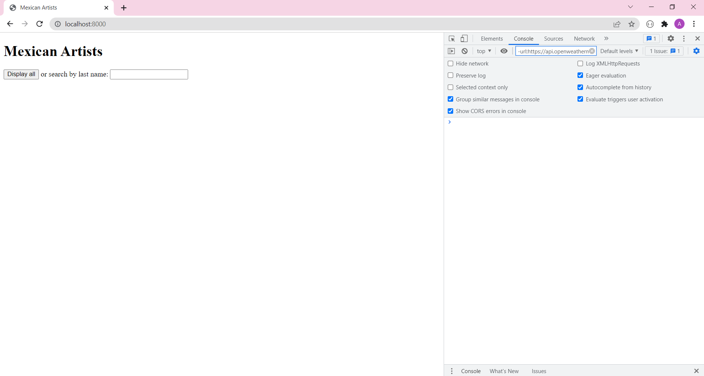
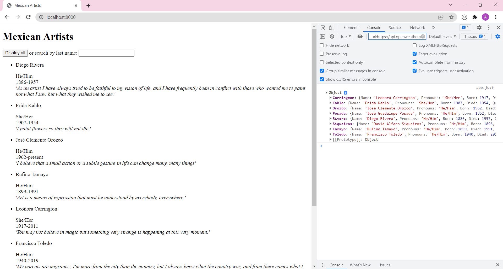
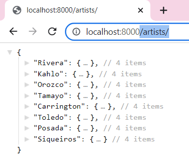
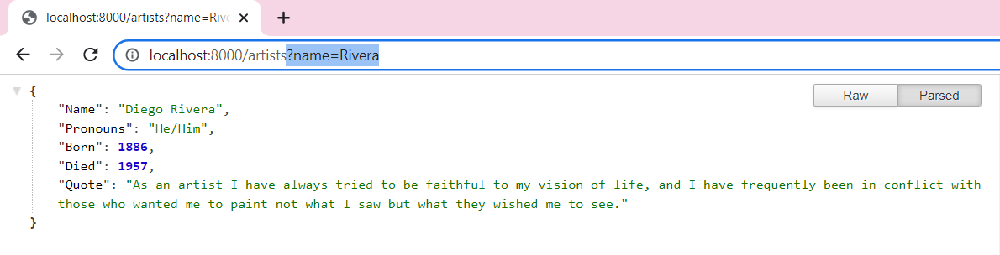
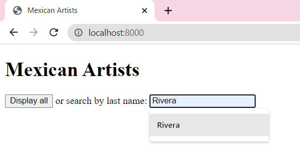
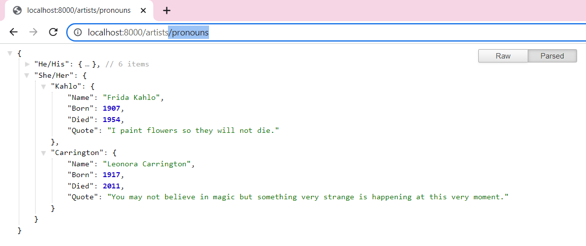
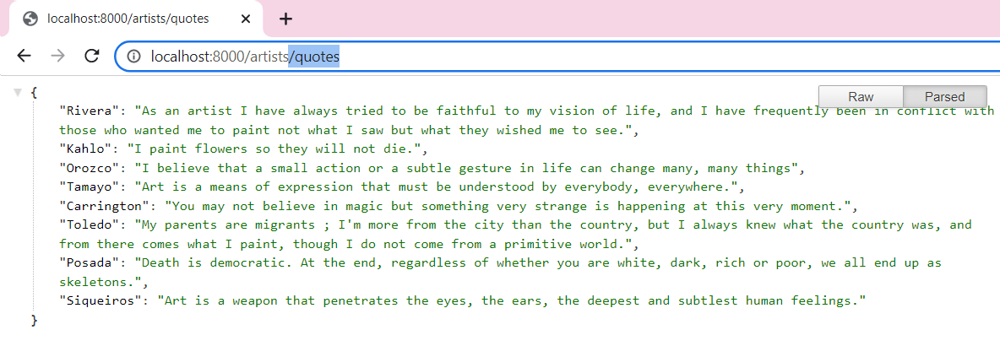
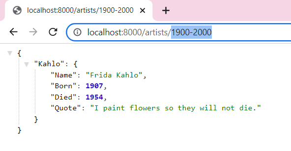
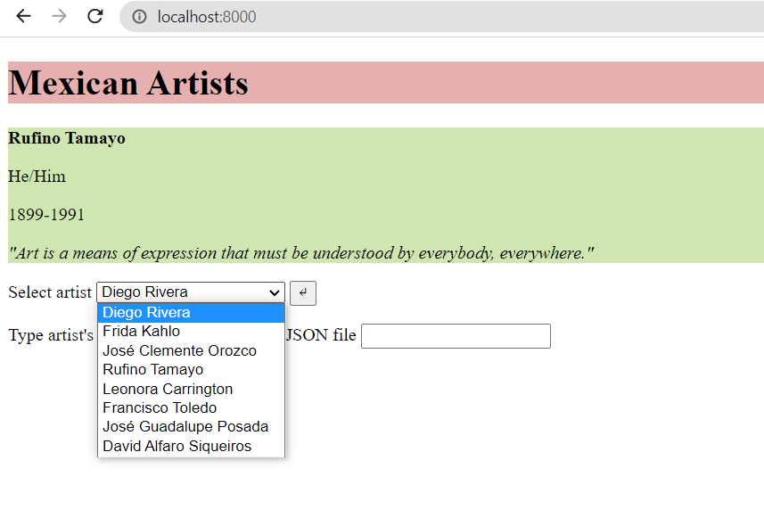

## Week 3:

### Class VI, pt.2 | March 3rd: _"MAKE a Node-Express app that serves a web page. This webpage should use an API that you need to fetch. The API should be from your server (a custom API). Make at least 1 API that uses .params or query."_

For the creation of my first server I reused my JSON about famous visual artists in Mexico from the [concept of my first project](https://github.com/andresugartechea/ConnectionsLab/blob/main/homework/week3/Project_1/mexartists.json). Thanks to this, I was able to find a couple of errors that I had made in the past when I was trying to fecth my .json file on JavaScript. 

#### Steps and results:  

## 1. Run the server: get information from the ‘/’ route and listen to the browser on port 8000.

For this first step, I followed the process seen in [class](https://github.com/MathuraMG/ConnectionsLabSpring22/tree/master/Week_6_Node_Express). In my _public_ folder I put a _index.html_ and _app.js_ to fecth and display the information from the API that I created.

localhost:**800**



The information contained in the API is displayed when the button is clicked



My localhost:800/**about** page describes briefly what the API is about.


localhost:800/about/**artists** displays the JSON file with all the information.



## 2. Add query to find artists by their name.

I based this part of the code on the exercise done in class using a different type of value (a string instead of a integer). This helped me learn and practice how _req.query_ works.

```
app.get('/artists', (req,res) => {
    let name = req.query.name;
    if (name){
        if(!mexArtists[name]) {
            res.json({error : "no artists found with this name"})
        }
        else {
            res.json(mexArtists[name]);
        }
    }
    else{
        res.json(mexArtists);
    }
})
```

localhost:800/about/artists?**name=SOMETHING**



I also learned how to use text input to change the URL and send a query. This is the code snippet from my _index.html_ that does that:

```
  <form action="/artists">
    <p> Search by last name: <input label = "name" type="text" id="name" name="name"> </p>
  </form>
```
Typing the name on the text box and pressing ENTER sends the query.



## 3. Add route to classify artists by their pronouns.

localhost:800/about/artists/**pronouns**



## 4. Add route to show only the artists' quotes.

localhost:800/about/artists/**quotes**



## 5. Add route to show artists from a certain period.

I used _req.params_ for this part. I used this [guide](https://expressjs.com/en/guide/routing.html) as reference to learn how to capture the values specified at their position in the URL.

localhost:800/about/artists/**:from-:to**



#### Next steps:

For the next steps I want to learn how to change the URL and send more queries with the user input. It's something that I couldn't implement in this version of my assignment and would like to change in the future.

#### New Version (March 8th):

Apparently, I had misunderstood the assignment instructions and I had forgotten to add a user flow from the front end. My new version looks like this:



[_Click here to download my website's files (old and new version)_](https://drive.google.com/drive/folders/1aLzL_ErmrO3g320udtbd_L1geiZB_Oqv?usp=sharing)

