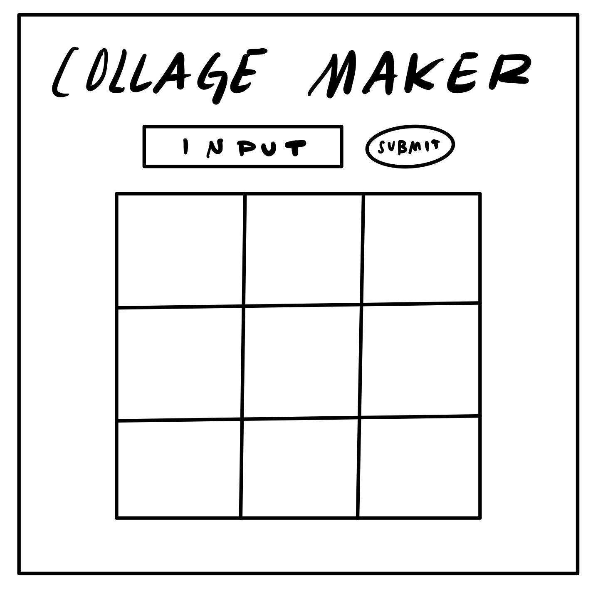
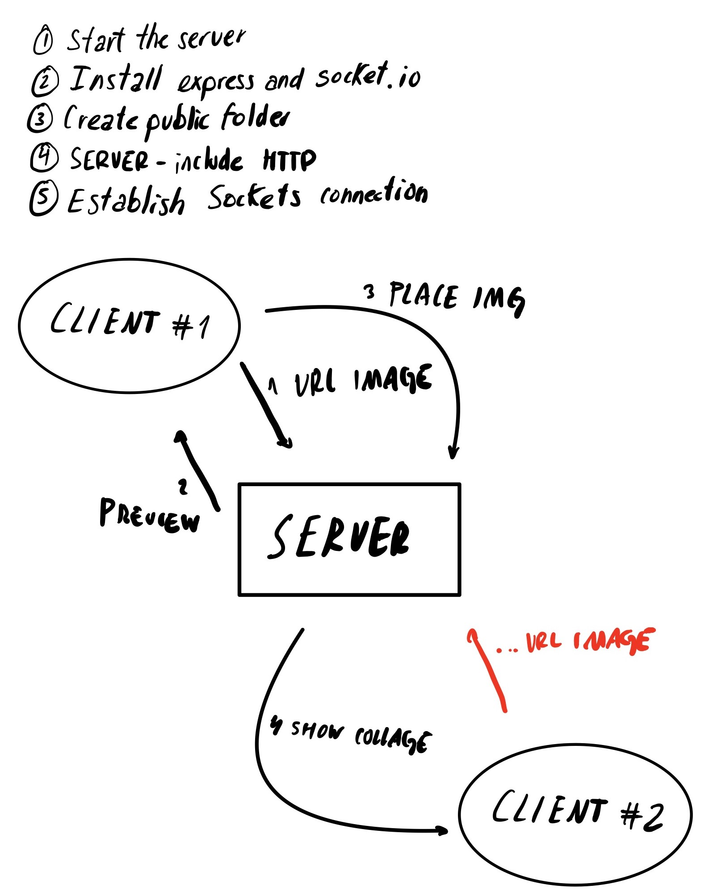
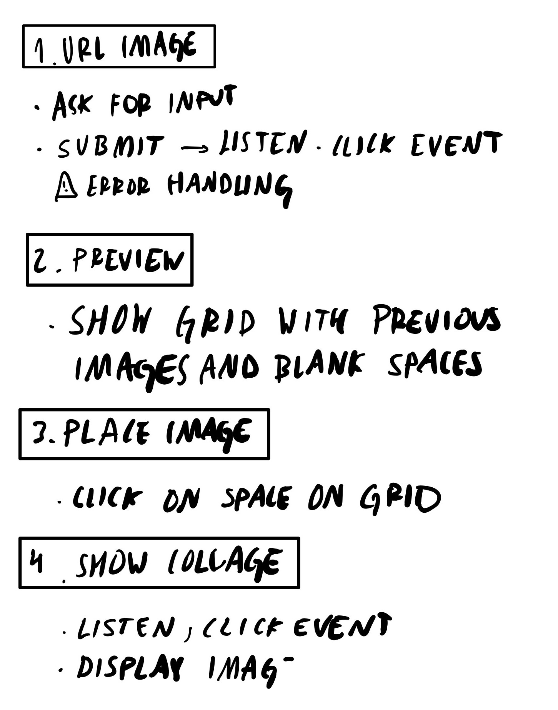
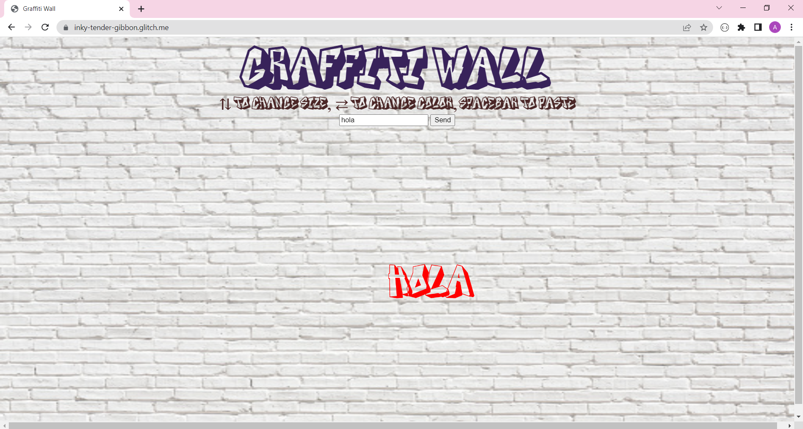

## Week 7 and 8:

### Class VII-VIII | March 28th: _"MAKE a Node-Express app that incorporates Socket.io. Try to incorporate the following: At least one ‘emit’ event on the server-side and one ‘emit’ event on the client-side The ability to open 2 browser tabs and share data in real-time between the two."_

In the exercises that we did in class, we learned how to make a [drawing app](https://github.com/MathuraMG/ConnectionsLabSpring22/tree/master/Week_8_Sockets) and a [simple chat room](https://github.com/MathuraMG/ConnectionsLabSpring22/tree/master/Week_9_Sockets). Both exercises helped me discover how to use [socket.io](https://socket.io/docs/v4/) to build my first connected application. My goal for this assignment was to combine both projects and create something where the user gives text input and draws on a P5.js canvas.


#### Wireframe and steps:

This idea started as a collage maker, where the user could insert the URL of an image and then this would appear on the canvas. Nonetheless, I couldn't figure out how to prevent the program from crashing before the user gives an input, since P5.js asks to preload the images in 'function setup()' before being able to display them. For this reason, my idea shifted to a "Graffiti Wall" with the same principles as the collage maker: the user is asked to insert a message and then they can place it wherever they want. Potentially, I will come back to this idea, because it'd fun to have a collective virtual collage maker.



I wrote down as suggested the steps for my code. At the end, the process for developping the Graffiti Wall was basically similar. So I include the steps I previously followed here:

 


#### Errors and next steps:

```
function draw(){   

    background(bg); 
  
    //if there's an input, if not just display default message
    if (msg_text){
        message = msg_text;
    }

    //NOTE: I NEED TO CHANGE THIS, SINCE IT MODIFIES ALL THE TEXTS AND NOT ONLY THE ONE THE USER IS CONTROLLING

    //The font size changes with the key arrows
    textSize(font_size);
    textAlign(CENTER);

    //to display a preview of the text
    text(message, mouseX, mouseY);

    //color mode changes with left and right key arrows
    if (color_mode == 1){
        fill(0);
    }
    else if (color_mode == 2){
        fill(255);
    }
    else if (color_mode == 3){
        fill(255,0,0);
    }
    else if (color_mode == 4){
        fill(0,255,0)
    }
    else if (color_mode == 5){
        fill(0,0,255);
    }

    //to draw each previous graffiti
    for (i in drawingCoords){
        text(drawingCoords[i].message, drawingCoords[i].x, drawingCoords[i].y);
    }

}

```

In _function keyPressed()_

```
    //to place the text and send the coordinates and text to all the users
    else if (key === " "){
        let x = mouseX;
        let y = mouseY;
    
        //NOTE: ADD color_mode AND font_size HERE, SO NOT ALL THE TEXTS CHANGE WITH THE KEY ARROWS
        let msgPost =
        { 
            x: round(x),
            y: round(y),
            message: message 
        };
        //console.log(msgPost)
        //emit this information to the server
        socket.emit("msgPositionData", msgPost)
    }
```

#### Preview: 



[_Click here to see my website_](https://inky-tender-gibbon.glitch.me/)
and [click here to see my code](https://glitch.com/edit/#!/inky-tender-gibbon)

